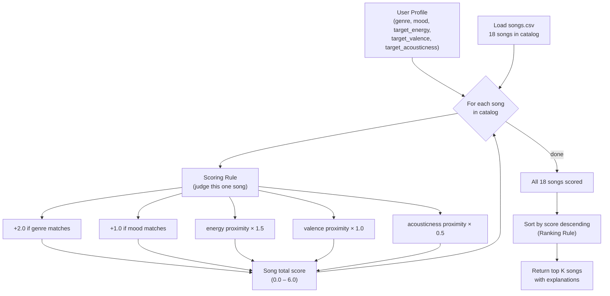

# 🎵 Music Recommender Simulation

## Project Summary

In this project you will build and explain a small music recommender system.

Your goal is to:

- Represent songs and a user "taste profile" as data
- Design a scoring rule that turns that data into recommendations
- Evaluate what your system gets right and wrong
- Reflect on how this mirrors real world AI recommenders

This simulator builds a content-based music recommender. It scores each song against a user's taste profile using genre, mood, energy, valence, and acousticness — then ranks all songs and returns the top matches. It is designed to be transparent: every recommendation comes with an explanation of which features drove the score.

---

## How The System Works

Real-world recommenders like Spotify and YouTube combine two main strategies. **Collaborative filtering** looks across millions of users — if people with similar listening histories also liked a song, it gets recommended to you, even if it sounds nothing like what you normally play. **Content-based filtering** takes the opposite approach: it analyzes the actual attributes of songs you liked (energy, mood, tempo) and finds songs with similar characteristics. Spotify's "Discover Weekly" uses both: collaborative filtering finds candidates, then audio features re-rank them. Our simulation focuses on the content-based side — it is simpler to reason about, easier to explain, and does not require any other users' data to work.

This version prioritizes the user's **genre** and **mood** as the strongest signals (because they define the broad "world" you want to be in), then uses **proximity scoring** on numerical features like energy and valence to reward songs that are *close* to what you want — not just generically high or low.

### Song features used

| Feature | Type | Role |
|---|---|---|
| `genre` | categorical | Broadest category filter — highest weight |
| `mood` | categorical | Emotional intent — second highest weight |
| `energy` | float 0–1 | How intense/driving the track feels |
| `valence` | float 0–1 | Musical positivity / happiness |
| `acousticness` | float 0–1 | Organic vs electronic texture |

### UserProfile stores

- `genre` — the genre they want most (e.g. `"lofi"`)
- `mood` — the emotional state they are targeting (e.g. `"chill"`)
- `target_energy` — a 0–1 float for how intense they want the music (e.g. `0.40`)
- `target_valence` — a 0–1 float for emotional positivity (e.g. `0.60`)
- `target_acousticness` — a 0–1 float for organic vs electronic sound (e.g. `0.75`)
- `likes_acoustic` — boolean shorthand for acoustic preference

**Example profile — "Late-Night Study Session":**

```python
user_prefs = {
    "genre": "lofi",
    "mood": "chill",
    "target_energy": 0.40,
    "target_valence": 0.60,
    "target_acousticness": 0.75,
    "likes_acoustic": True
}
```

*Critique:* This profile **can** differentiate "intense rock" from "chill lofi" — Storm Runner (rock/intense, energy 0.91) scores 0 on both categorical matches and loses ~0.76 on energy proximity, while Library Rain (lofi/chill, energy 0.35) gains the full +2.0 + +1.0 + high proximity. The risk is narrowness: because lofi appears three times in the catalog, the top results will cluster around those three songs, which is a textbook filter-bubble effect.

---

### Algorithm Recipe (finalized)

**Maximum possible score: 6.0**

| Signal | Rule | Points |
|---|---|---|
| Genre match | `song.genre == user.genre` | **+2.0** |
| Mood match | `song.mood == user.mood` | **+1.0** |
| Energy proximity | `(1 - \|song.energy − user.target_energy\|) × 1.5` | **0 – 1.5** |
| Valence proximity | `(1 - \|song.valence − user.target_valence\|) × 1.0` | **0 – 1.0** |
| Acousticness proximity | `(1 - \|song.acousticness − user.target_acousticness\|) × 0.5` | **0 – 0.5** |

**Proximity formula explained:** `1 - |a - b|` gives 1.0 when song value exactly matches the target and tapers linearly to 0.0 at maximum distance. This rewards closeness — not just "higher is better."

**Weight reasoning:**
- Genre outweighs mood: a jazz fan rarely wants metal even if the mood label matches
- Energy outweighs valence: energy is the most immediately felt difference between two songs
- Acousticness is a tiebreaker, not a primary driver

---

### Data Flow



---

### Potential Biases

- **Genre dominance:** At 2.0 points, a genre match alone can outweigh perfect numerical alignment. A great ambient track scored against a "lofi" profile will cap at 4.0 even with perfect energy/valence/acousticness.
- **Filter bubble:** The scoring never rewards novelty or diversity — it always picks the closest match, so similar songs cluster at the top.
- **Catalog skew:** Lofi and pop appear most in the dataset. A "rock" or "classical" user will get fewer strong matches simply because the catalog is thin for their genre.
- **Ordinal vs categorical mood:** "Chill" and "relaxed" feel similar, but the algorithm treats them as completely different strings — a relaxed jazz track scores 0 on mood for a "chill" user.

### How recommendations are chosen

All songs in the catalog are scored, then sorted highest-to-lowest. The top `k` songs (default 5) are returned. This is the **Ranking Rule** — applying the Scoring Rule to every song and picking the winners.

---

## Getting Started

### Setup

1. Create a virtual environment (optional but recommended):

   ```bash
   python -m venv .venv
   source .venv/bin/activate      # Mac or Linux
   .venv\Scripts\activate         # Windows

2. Install dependencies

```bash
pip install -r requirements.txt
```

3. Run the app:

```bash
python -m src.main
```

### Running Tests

Run the starter tests with:

```bash
pytest
```

You can add more tests in `tests/test_recommender.py`.

---

## Experiments You Tried

Use this section to document the experiments you ran. For example:

- What happened when you changed the weight on genre from 2.0 to 0.5
- What happened when you added tempo or valence to the score
- How did your system behave for different types of users

---

## Limitations and Risks

Summarize some limitations of your recommender.

Examples:

- It only works on a tiny catalog
- It does not understand lyrics or language
- It might over favor one genre or mood

You will go deeper on this in your model card.

---

## Reflection

Read and complete `model_card.md`:

[**Model Card**](model_card.md)

Write 1 to 2 paragraphs here about what you learned:

- about how recommenders turn data into predictions
- about where bias or unfairness could show up in systems like this


---

## 7. `model_card_template.md`

Combines reflection and model card framing from the Module 3 guidance. :contentReference[oaicite:2]{index=2}  

```markdown
# 🎧 Model Card - Music Recommender Simulation

## 1. Model Name

Give your recommender a name, for example:

> VibeFinder 1.0

---

## 2. Intended Use

- What is this system trying to do
- Who is it for

Example:

> This model suggests 3 to 5 songs from a small catalog based on a user's preferred genre, mood, and energy level. It is for classroom exploration only, not for real users.

---

## 3. How It Works (Short Explanation)

Describe your scoring logic in plain language.

- What features of each song does it consider
- What information about the user does it use
- How does it turn those into a number

Try to avoid code in this section, treat it like an explanation to a non programmer.

---

## 4. Data

Describe your dataset.

- How many songs are in `data/songs.csv`
- Did you add or remove any songs
- What kinds of genres or moods are represented
- Whose taste does this data mostly reflect

---

## 5. Strengths

Where does your recommender work well

You can think about:
- Situations where the top results "felt right"
- Particular user profiles it served well
- Simplicity or transparency benefits

---

## 6. Limitations and Bias

Where does your recommender struggle

Some prompts:
- Does it ignore some genres or moods
- Does it treat all users as if they have the same taste shape
- Is it biased toward high energy or one genre by default
- How could this be unfair if used in a real product

---

## 7. Evaluation

How did you check your system

Examples:
- You tried multiple user profiles and wrote down whether the results matched your expectations
- You compared your simulation to what a real app like Spotify or YouTube tends to recommend
- You wrote tests for your scoring logic

You do not need a numeric metric, but if you used one, explain what it measures.

---

## 8. Future Work

If you had more time, how would you improve this recommender

Examples:

- Add support for multiple users and "group vibe" recommendations
- Balance diversity of songs instead of always picking the closest match
- Use more features, like tempo ranges or lyric themes

---

## 9. Personal Reflection

A few sentences about what you learned:

- What surprised you about how your system behaved
- How did building this change how you think about real music recommenders
- Where do you think human judgment still matters, even if the model seems "smart"

