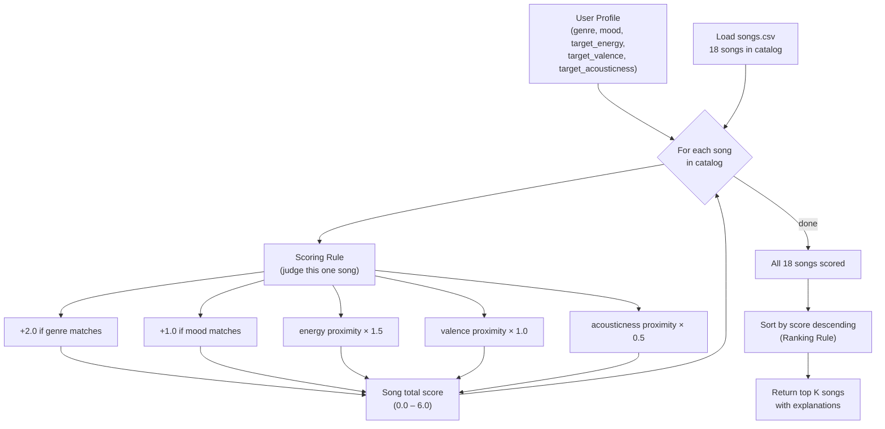
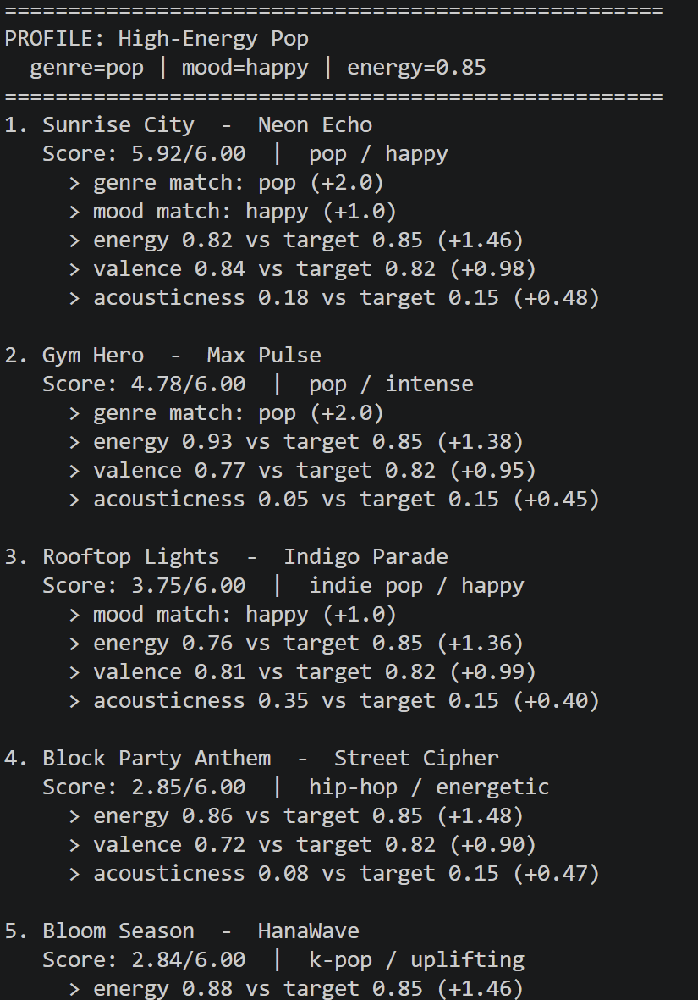
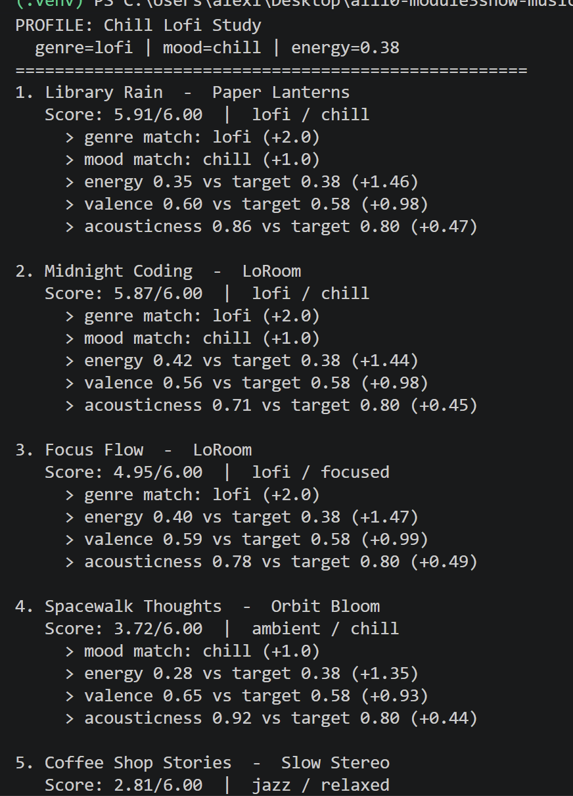

# 🎵 Music Recommender Simulation

## Project Summary

In this project you will build and explain a small music recommender system.

Your goal is to:

- Represent songs and a user "taste profile" as data
- Design a scoring rule that turns that data into recommendations
- Evaluate what your system gets right and wrong
- Reflect on how this mirrors real world AI recommenders

This simulator builds a content-based music recommender. It scores each song against a user's taste profile using genre, mood, energy, valence, and acousticness — then ranks all songs and returns the top matches. It is designed to be transparent: every recommendation comes with an explanation of which features drove the score.

---

## How The System Works

Real-world recommenders like Spotify and YouTube combine two main strategies. **Collaborative filtering** looks across millions of users — if people with similar listening histories also liked a song, it gets recommended to you, even if it sounds nothing like what you normally play. **Content-based filtering** takes the opposite approach: it analyzes the actual attributes of songs you liked (energy, mood, tempo) and finds songs with similar characteristics. Spotify's "Discover Weekly" uses both: collaborative filtering finds candidates, then audio features re-rank them. Our simulation focuses on the content-based side — it is simpler to reason about, easier to explain, and does not require any other users' data to work.

This version prioritizes the user's **genre** and **mood** as the strongest signals (because they define the broad "world" you want to be in), then uses **proximity scoring** on numerical features like energy and valence to reward songs that are *close* to what you want — not just generically high or low.

### Song features used

| Feature | Type | Role |
|---|---|---|
| `genre` | categorical | Broadest category filter — highest weight |
| `mood` | categorical | Emotional intent — second highest weight |
| `energy` | float 0–1 | How intense/driving the track feels |
| `valence` | float 0–1 | Musical positivity / happiness |
| `acousticness` | float 0–1 | Organic vs electronic texture |

### UserProfile stores

- `genre` — the genre they want most (e.g. `"lofi"`)
- `mood` — the emotional state they are targeting (e.g. `"chill"`)
- `target_energy` — a 0–1 float for how intense they want the music (e.g. `0.40`)
- `target_valence` — a 0–1 float for emotional positivity (e.g. `0.60`)
- `target_acousticness` — a 0–1 float for organic vs electronic sound (e.g. `0.75`)
- `likes_acoustic` — boolean shorthand for acoustic preference

**Example profile — "Late-Night Study Session":**

```python
user_prefs = {
    "genre": "lofi",
    "mood": "chill",
    "target_energy": 0.40,
    "target_valence": 0.60,
    "target_acousticness": 0.75,
    "likes_acoustic": True
}
```

*Critique:* This profile **can** differentiate "intense rock" from "chill lofi" — Storm Runner (rock/intense, energy 0.91) scores 0 on both categorical matches and loses ~0.76 on energy proximity, while Library Rain (lofi/chill, energy 0.35) gains the full +2.0 + +1.0 + high proximity. The risk is narrowness: because lofi appears three times in the catalog, the top results will cluster around those three songs, which is a textbook filter-bubble effect.

---

### Algorithm Recipe (finalized)

**Maximum possible score: 6.0**

| Signal | Rule | Points |
|---|---|---|
| Genre match | `song.genre == user.genre` | **+2.0** |
| Mood match | `song.mood == user.mood` | **+1.0** |
| Energy proximity | `(1 - \|song.energy − user.target_energy\|) × 1.5` | **0 – 1.5** |
| Valence proximity | `(1 - \|song.valence − user.target_valence\|) × 1.0` | **0 – 1.0** |
| Acousticness proximity | `(1 - \|song.acousticness − user.target_acousticness\|) × 0.5` | **0 – 0.5** |

**Proximity formula explained:** `1 - |a - b|` gives 1.0 when song value exactly matches the target and tapers linearly to 0.0 at maximum distance. This rewards closeness — not just "higher is better."

**Weight reasoning:**
- Genre outweighs mood: a jazz fan rarely wants metal even if the mood label matches
- Energy outweighs valence: energy is the most immediately felt difference between two songs
- Acousticness is a tiebreaker, not a primary driver

---

### Data Flow



---

### Potential Biases

- **Genre dominance:** At 2.0 points, a genre match alone can outweigh perfect numerical alignment. A great ambient track scored against a "lofi" profile will cap at 4.0 even with perfect energy/valence/acousticness.
- **Filter bubble:** The scoring never rewards novelty or diversity — it always picks the closest match, so similar songs cluster at the top.
- **Catalog skew:** Lofi and pop appear most in the dataset. A "rock" or "classical" user will get fewer strong matches simply because the catalog is thin for their genre.
- **Ordinal vs categorical mood:** "Chill" and "relaxed" feel similar, but the algorithm treats them as completely different strings — a relaxed jazz track scores 0 on mood for a "chill" user.

### How recommendations are chosen

All songs in the catalog are scored, then sorted highest-to-lowest. The top `k` songs (default 5) are returned. This is the **Ranking Rule** — applying the Scoring Rule to every song and picking the winners.

---

## Getting Started

### Setup

1. Create a virtual environment (optional but recommended):

   ```bash
   python -m venv .venv
   source .venv/bin/activate      # Mac or Linux
   .venv\Scripts\activate         # Windows

2. Install dependencies

```bash
pip install -r requirements.txt
```

3. Run the app:

```bash
python -m src.main
```

### Running Tests

Run the starter tests with:

```bash
pytest
```

You can add more tests in `tests/test_recommender.py`.

---

## Terminal Output

The app was run with `python -m src.main` from the project root. Five profiles were tested — three standard and two adversarial edge cases.





```
Loaded 18 songs from data/songs.csv

====================================================
PROFILE: High-Energy Pop
  genre=pop | mood=happy | energy=0.85
====================================================
1. Sunrise City  -  Neon Echo
   Score: 5.92/6.00  |  pop / happy
     > genre match: pop (+2.0)
     > mood match: happy (+1.0)
     > energy 0.82 vs target 0.85 (+1.46)
     > valence 0.84 vs target 0.82 (+0.98)
     > acousticness 0.18 vs target 0.15 (+0.48)

2. Gym Hero  -  Max Pulse
   Score: 4.78/6.00  |  pop / intense
     > genre match: pop (+2.0)
     > energy 0.93 vs target 0.85 (+1.38)
     > valence 0.77 vs target 0.82 (+0.95)
     > acousticness 0.05 vs target 0.15 (+0.45)

3. Rooftop Lights  -  Indigo Parade
   Score: 3.75/6.00  |  indie pop / happy
     > mood match: happy (+1.0)
     > energy 0.76 vs target 0.85 (+1.36)
     > valence 0.81 vs target 0.82 (+0.99)
     > acousticness 0.35 vs target 0.15 (+0.40)

4. Block Party Anthem  -  Street Cipher
   Score: 2.85/6.00  |  hip-hop / energetic
5. Bloom Season  -  HanaWave
   Score: 2.84/6.00  |  k-pop / uplifting

====================================================
PROFILE: Chill Lofi Study
  genre=lofi | mood=chill | energy=0.38
====================================================
1. Library Rain  -  Paper Lanterns
   Score: 5.91/6.00  |  lofi / chill
     > genre match: lofi (+2.0)
     > mood match: chill (+1.0)
     > energy 0.35 vs target 0.38 (+1.46)
     > valence 0.60 vs target 0.58 (+0.98)
     > acousticness 0.86 vs target 0.80 (+0.47)

2. Midnight Coding  -  LoRoom
   Score: 5.87/6.00  |  lofi / chill
3. Focus Flow  -  LoRoom
   Score: 4.95/6.00  |  lofi / focused
4. Spacewalk Thoughts  -  Orbit Bloom
   Score: 3.72/6.00  |  ambient / chill
5. Coffee Shop Stories  -  Slow Stereo
   Score: 2.81/6.00  |  jazz / relaxed

====================================================
PROFILE: Deep Intense Rock
  genre=rock | mood=intense | energy=0.92
====================================================
1. Storm Runner  -  Voltline
   Score: 5.94/6.00  |  rock / intense
     > genre match: rock (+2.0)
     > mood match: intense (+1.0)
     > energy 0.91 vs target 0.92 (+1.48)
     > valence 0.48 vs target 0.45 (+0.97)
     > acousticness 0.10 vs target 0.08 (+0.49)

2. Gym Hero  -  Max Pulse          Score: 3.64  |  pop / intense  (mood match only)
3. Break the Walls  -  Iron Circuit  Score: 2.78  |  metal / angry  (no label match)

Note: Break the Walls ranks below a pop song because "metal" != "rock" as strings.
This is the genre-label bias in action.

====================================================
PROFILE: Adversarial - Loud Sad
  genre=folk | mood=sad | energy=0.9
====================================================
1. Empty Porch  -  The Willows
   Score: 4.90/6.00  |  folk / sad
     > genre match: folk (+2.0)
     > mood match: sad (+1.0)
     > energy 0.22 vs target 0.90 (+0.48)  <-- energy is completely wrong

The system picks this song because genre+mood = 3.0 pts overwhelms the energy
mismatch. It has no way to detect that the preferences contradict each other.

====================================================
PROFILE: Adversarial - Unknown Genre
  genre=bossa nova | mood=nostalgic | energy=0.45
====================================================
1. Midnight Coding   Score: 2.86/6.00  |  lofi / chill
2. Focus Flow        Score: 2.82/6.00  |  lofi / focused
3. Library Rain      Score: 2.72/6.00  |  lofi / chill
4. Coffee Shop       Score: 2.72/6.00  |  jazz / relaxed

No genre or mood points available — max possible score is 3.0/6.00.
Top 4 results are within 0.14 pts of each other. Ranking is nearly arbitrary.
```

---

## Experiments

**Weight shift experiment:** Genre weight halved (+2.0 → +1.0), energy weight doubled (×1.5 → ×3.0).

- For "Deep Intense Rock": Break the Walls jumped from 2.78 → 4.20, surfacing as a more musically accurate result. The gap between #1 and #2 shrank from 2.30 to 1.30.
- For "Loud Sad": Empty Porch still won — even doubled energy weight couldn't overcome a 3.0-point genre+mood advantage. No weight change alone fixes a self-contradictory profile.
- Verdict: lower genre weight makes results feel more nuanced, but it is not a universal improvement.

---

## Limitations and Risks

- Only works on an 18-song catalog — too small to draw real conclusions
- Treats genre and mood labels as unrelated strings ("rock" and "metal" are strangers to the algorithm)
- Cannot detect when a user's preferences contradict each other
- No diversity: all top results can share the same genre for well-represented categories
- Audio values were manually assigned, not sourced from real audio analysis

See [model_card.md](model_card.md) for the full bias analysis.

---

## Reflection

The most surprising thing about this project was how quickly simple math starts to *feel* like a real recommendation. When the lofi profile returns Library Rain and Midnight Coding at the top, it feels right — not because the algorithm is doing anything clever, but because the data is set up so the right answer falls out naturally. That made me think a lot about how much of what feels "intelligent" in real systems is actually just good feature selection and clean data.

The adversarial profiles were the most educational part. Building a profile with conflicting preferences — high energy but sad folk — showed that the algorithm will always produce a confident-looking ranked list, even when the request doesn't make sense. There's no humility built in. Real systems solve this with collaborative filtering (what did similar users actually listen to?) or by learning implicit preferences rather than asking users to describe themselves explicitly.

Where AI tools helped most during this project: generating boilerplate quickly (CSV loading, dataclasses, formatting). Where I had to double-check: the scoring logic. A few suggestions used simple subtraction instead of proximity scoring, or dropped the reasons list from the return value. Having a written design before coding made those mismatches easy to catch.

[**Full Model Card**](model_card.md) | [**Profile Comparison Notes**](reflection.md)
